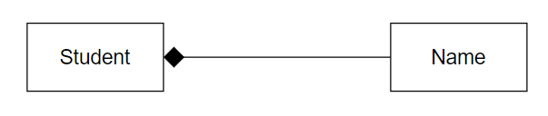
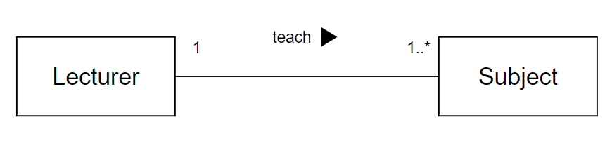
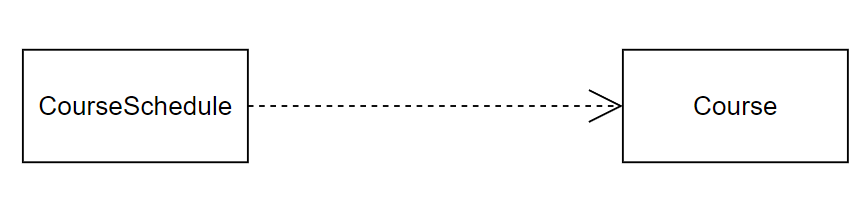
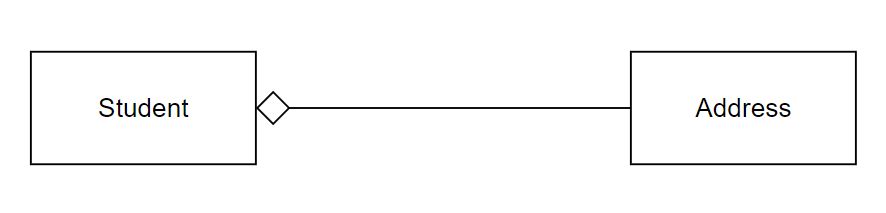
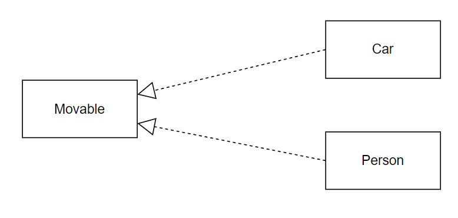
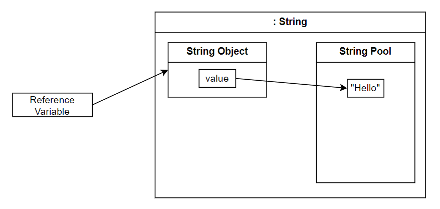

# AACS2204 JAN 2023 Answers

[Link to the paper](https://eprints.tarc.edu.my/23979/1/AACS2204.pdf)

- [Question 1](#question-1)
- [Question 2](#question-2)
- [Question 3](#question-3)
- [Question 4](#question-4)

## Answers

### Question 1

a) Structured design is a structural approach to solving a problem by dividing the problem into smaller subproblems and solving accordingly. This approach simplifies huge problems into numbers in manageable sizes, which eases the planning of solutions.

- Step 1: Divide the main problem into many small subproblems.
- Step 2: Analyze each subproblem and obtain the solution to the subproblems.
- Step 3: Combine the subproblems' solutions bottom-up to solve the main problem.

b) Business Field: Finance; Main Object: Bank Account

c) i) Constant is a read-only value initialized with value upon declaration and is immutable in future use.

ii) Constant enhance code readability by replacing the [magic number](https://en.wikipedia.org/wiki/Magic_number_(programming)) with a meaningful name in the program code. Constant also enforces read-only towards the data that is not meant to be altered, which can avoid data tampering that leads to unintentional behaviour.

iii) `private static final double SST = 0.08;`

d)

i) Method signature consists of the method name and parameter list, which is the identity of the method that the compiler used to recognise the method to invoke.

`add(int a, int b)`

ii) Variable that is declared in the parameter list that will be substituted with argument value, and used within the method.

variable a and b in `add(int a, int b)`

iii) Can be called as argument, which is the variable that passed into the invoked method brackets.

variable x and y in
```
int x = 1, y = 2;
int z = add(x, y);
```

### Question 2

a) i) 

Method Overloading | Method Overriding
-|-
Decides method implementation at compile time | Decides method implementation at runtime
Decide by matching the method signature | Decide by searching and matching the implementation from the object's actual class up to its parent class hierarchically.

```java
// Method Overloading
public class Calc {
  // ...

  public int add(int a, int b) {
    return a + b;
  }

  public int add(int a, int b, int c) {
    return a + b + c;
  }
}
```

```java
// Method Overriding
public class Square {
  // ...

  public double getArea() {
    return side * side;
  }
}

public class Cube {
  //...

  @Override
  public double getArea() {
    return side * side * 6;
  }
}
```

ii)

Accessor | Mutator
-|-
Used to retrieve the value of the method state | Used to modify the value of the method state
Method has the return type of the respective variable to retrieve | Method has the type of `void`

```java
public class Student {
  private String name;
  // ...

  // accessor
  public String getName() {
    return this.name;
  }

  // mutator
  public void setName(String name) {
    this.name = name;
  }
  
}
```

iii)

Static Variable | Instance Variable
-|-
Variable lifetime is tied to the class | Variable lifetime is tied to the instance object
Can exist without instantiating any object | Cannot exist without instantiating any object

```java
public class Student {
  // instance variable
  private String id;
  // static variable
  private static int numberOfStudents;
}
```

b) Encourage reusability which reduces duplication of code with similar purpose.

### Question 3

a) 

i) A relationship showing that the class is ***exclusively owned*** by another class. The child that composites to another cannot exist independently of its parent.



ii) A relationship describes an activity between two classes. The classes ***do not own each other***.



> Need to have multiplicity, action and direction

iii) A weak relationship showing one class ***uses*** another in their operation. The failure of the supplier class only causes failure to the method of the client class, instead of the whole class.



iv) A relationship showing one class ***owns*** the other, but the class can exist independently.



v) It shows one class ***can*** do a specific operation in the interface. On the other way around, the interface enforces behaviours onto the classes that implement it, enabling them to be generalised into performing specific operations.



b) An object whose content is not modifiable upon its instantiation. The immutable class has 3 criteria
  - The class data are all private
  - The class has no mutator methods
  - The class has no accessor methods that return a reference to a mutable data field object

> Clarification of the third point
>
> If a class getter returns a non-primitive mutable object, the object can be modified by its setter, making the class that owns this mutable object have its content changed too. Hence, we cannot have a getter for non-primitive objects so the content within the immutable class is truly absolute.

### Question 4

a) String variable is the reference variable in stack memory, which points to the String object in the heap memory. The String object has its value referencing the one within the String pool, which is a storage for every string value created. The String pool ensures that the String objects that have the same content will reference the same value within the pool, which can reduce duplication and increase program efficiency.



b)

Public | Protected | Package (Default) | Private
-|-|-|-
Accessible by all classes | Accessible by classes from the same package or subclasses only | Accessible by classes from the same package only | Accessible from within the class only

c)

- Encapsulation: A practice of wrapping all data and methods that act upon the data into a single unit/module/class. This reduces the scope of the data to only the methods within the class, which can avoid data tampering which leads to unintentional behaviour. 

- Inheritance: A practice to use a general class to create classes. The general class contains general data and behaviours that are shared among subclasses, and each subclass can possess more specific states and behaviours. This can reduce code duplication and draw the hierarchical relationship among the classes, improving readability and maintainability.

- Polymorphism: A practice of using the same expression to invoke different operations. This allows the module to be easily extended without much modification and, at the same time enhances reusability which leads to better maintainability.

d) Used to call the superclass methods, including the constructor. It can also distinguish the method from the subclass and the overridden method from the superclass.
